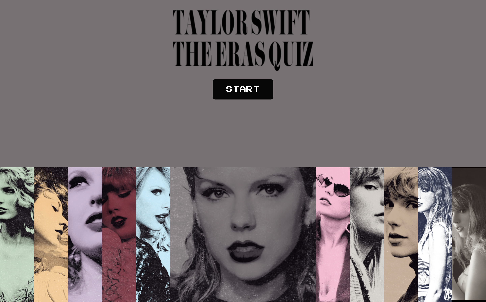

# Taylor Swift Eras Quiz 
## Work in Progress

This is a work-in-progress interactive quiz app inspired by Taylor Swift's Eras.
Users can select an Era, see custom styling for that Era, and play a music quiz featuring short YouTube snippets from each album.

## Features (so far)

- **Interactive Eras Selector**  
  - Expandable, animated Eras carousel with album artwork.
  - Smooth hover and selection effects with flex-based scaling animations.
  - Each Era has its own color theme and button styling.

- **Dynamic Start Button**  
  - Pixel-style retro button (`Press Start 2P` font).  
  - Era-specific background and text color.
  - Animations via **Framer Motion**.

- **Custom Theming**  
  - Background color of the app changes based on the selected Era.
  - Button styling is automatically tied to the Era.

- **Music Quiz**
  - Listen to 10-second snippets of songs from the selected Era.
  - Multiple-choice quiz with 4 options per question.
  - Correct/incorrect feedback with colored highlights.
  - Real-time score tracking and final score display.
  - Ensures each song is only played once per quiz.

- **YouTube Integration (Backend Helper)**  
  - `youtubeIDs.py` script fetches official audio video IDs from the **YouTube Data API** for each track in a `songs.json`.  
  - Saves results into `songs_with_ids.json` and a ready-to-use `songs_with_ids.js`.

---
